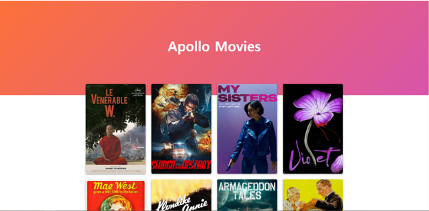
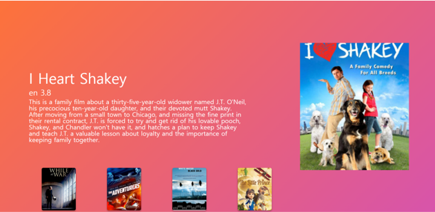

# 🎬 Apollo Movies

> 노마드코더 Course 중 React, Apollo and GraphQL을 이용한 영화 웹 서비스 만들기


## 💻 실행화면

### 🎡 메인화면

 


### 🎡 상세페이지

 


## 🎯 프로젝트 소개

**"Apollo Movies는 영화 리스트와 해당 영화에 대한 상세 페이지를 볼 수 있습니다."**

`Apollo Movies`는 `React JS`, `Apollo`와 `GraphQL`을 사용하여 제작한 웹 어플리케이션입니다.

`yts` 영화 API를 `server`의 `graphQL` 을 사용하여 영화 리스트를 나타내고, 포스터를 클릭하면 해당 영화의 상세 내용과 그 영화의 `suggestion`을 나타내는 페이지를 구현했습니다. 😎


## ⛳ 프로젝트 시작하기

### 🎨 Clone

```
git clone https://github.com/souvenir718/apollo_movies.git
```


### 🎨 Server Start

```
cd server
npm install
npm start
```


### 🎨 Client Start

```
npm install
npm start
```


### 🏆 [Certificate](https://github.com/souvenir718/TIL/blob/master/Certificate/GraphQL%EB%A1%9C%20%EC%98%81%ED%99%94%20%EC%9B%B9%20%EC%95%B1%20%EB%A7%8C%EB%93%A4%EA%B8%B0.pdf)